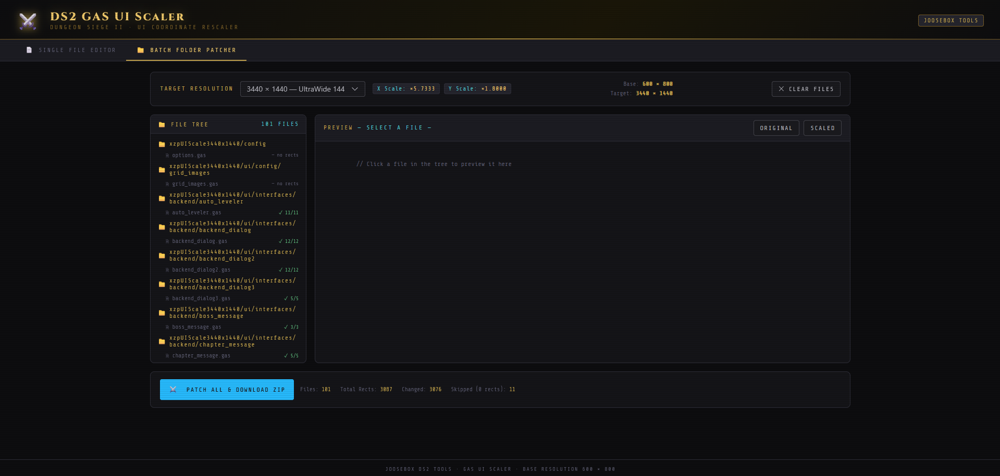

This is for use on UI to auto edit rects, even accepts batch folders with subdir auto (make sure target size selected first)

I used on most of Logic.ds2res's ```\ui\interfaces\backend``` gas files to create the scale mod. (well I used my old script I have not used this one)

This will auto update the rects inside the gas files to scale them to match your resolution. : NOTE the game is 4:3 we are stretching things kind of funny, might need to update to include the 4:3 version of every resolution instead.

Use: Download index.html it's all in one, load it in your web-browser (Tested via Firefox)
